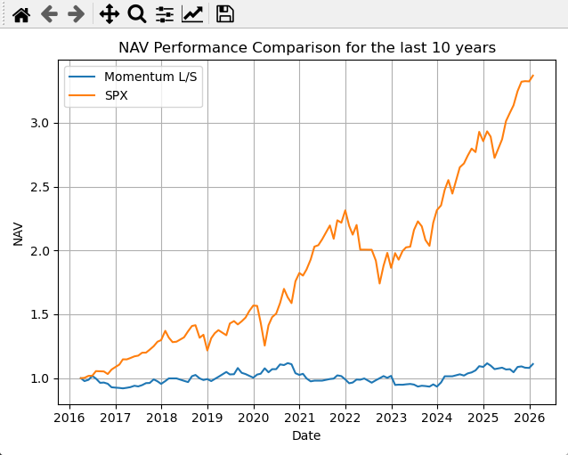
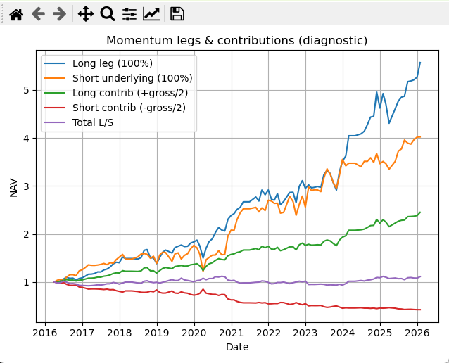
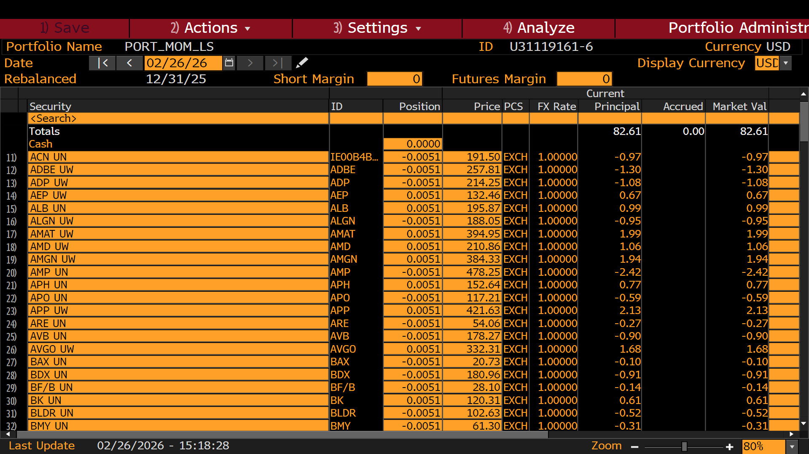
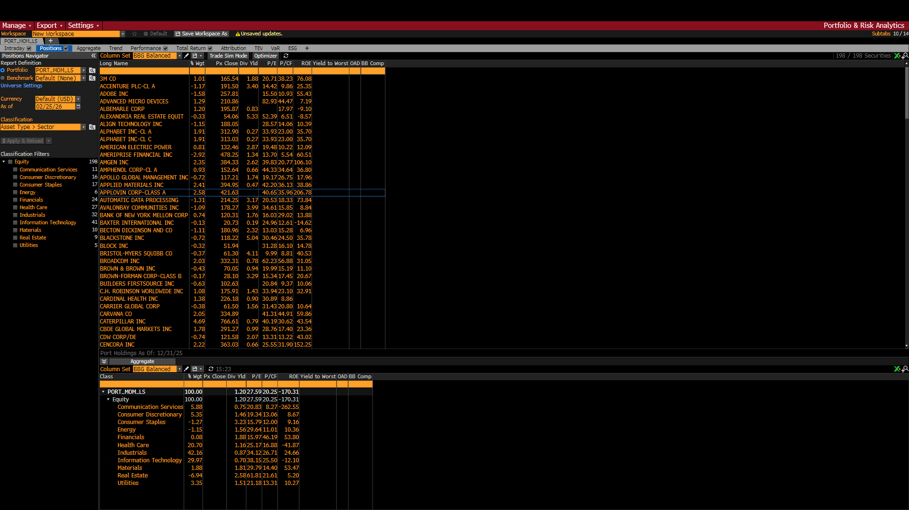
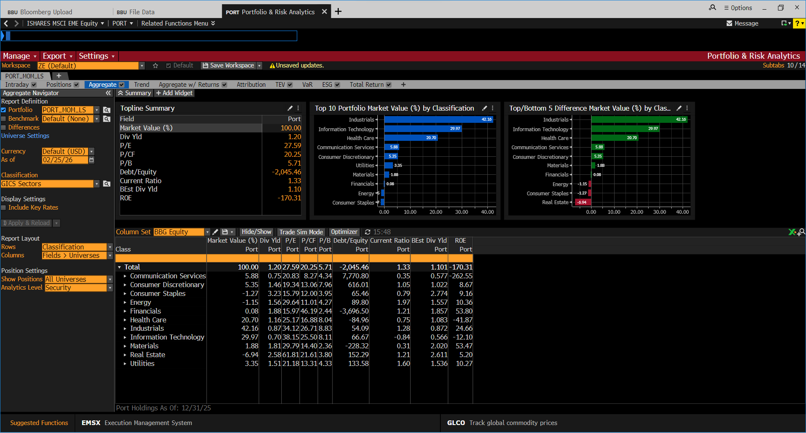
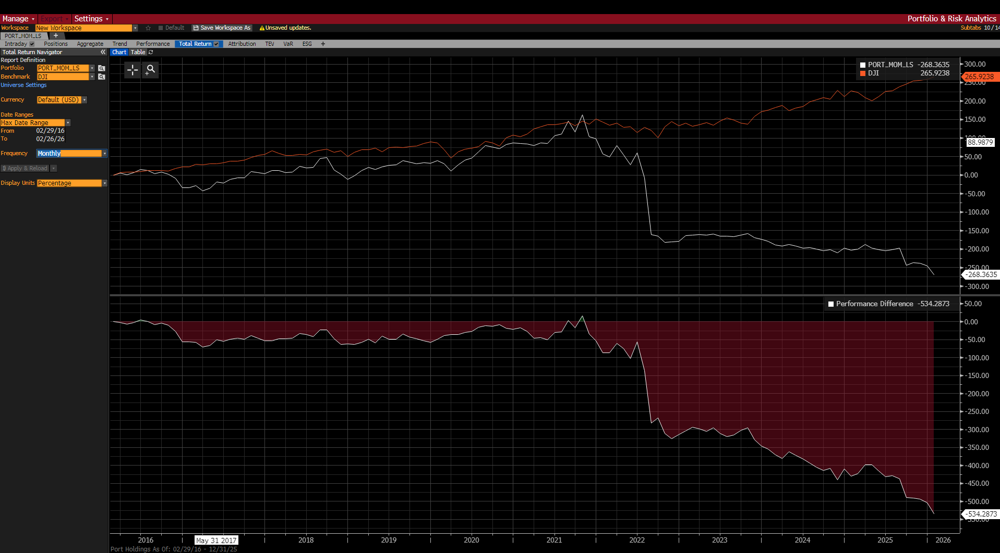

# Bloomberg Market-Neutral Allocation Backtester (SP500)

Ce projet contient un petit moteur de backtesting destiné à construire et analyser des portefeuilles market-neutral à partir de données de prix issus de Bloomberg.

---

## Architecture

- **`main.py`** – point d’entrée : orchestre le flux (chargement des données, allocation, calcul des métriques, visualisations des performances).
- **`bloomberg.py`** – gestion de la récupération des données Bloomberg, dans notre cas extraction des composants du SP500 sur les 10 dernières années en veillant à ne pas se faire avoir par le biais du survivant (BDS + BDH via BLPAPI).
- **`allocation.py`** – logique de construction du portefeuille, dans notre cas on utilise une allocation mensuelle **cross-sectional momentum** :
  - chaque mois classement des derniers rendements **12 mois** des ~500 compagnies sans look-ahead bias.
  - **long** les deux premiers déciles pondéré de manière égale.
  - **short** les deux derniers déciles pondéré de manière égéle.
- **`metrics.py`** – calcul des indicateurs de performance (rendement, volatilité, ratios, etc.).
- **`visualisations.py`** – génération de graphiques et tableaux pour analyser les résultats.
- **`cache/`** – répertoire où sont stockées localement les données téléchargées.

---

## Utilisation

1. Configurer vos identifiants Bloomberg dans **`bloomberg.py`**.
2. Lancer le backtest :
   ```bash
   python main.py

---

## Résultats

Voici les résultats de l'allocation sur les 10 dernières années, performances long-short market neutral pas attrayante, long ou trend aurait peut-être était plus intéressante.

**Momentum L/S**
- Cumulative return: 0.11
- Max drawdown: -0.16
- Sharpe: 0.16

**Long leg (winners, 100%)**
- Cumulative return: 4.57
- Max drawdown: -0.19
- Sharpe: 1.18

**Short underlying (losers, 100% long-equivalent)**
- Cumulative return: 3.02
- Max drawdown: -0.31
- Sharpe: 0.85

**Benchmark SPX**
- Cumulative return: 2.37
- Max drawdown: -0.25
- Sharpe: 0.96






---

## BBU et Port Bloomberg

Le code met également en forme un fichier Excel prêt à l'import via BBU Bloomberg contenant les pondérations mensuelles de la stratégie d'allocation. Ce qui permet d'analyser le portefeuille avec les analytics Bloomberg.







